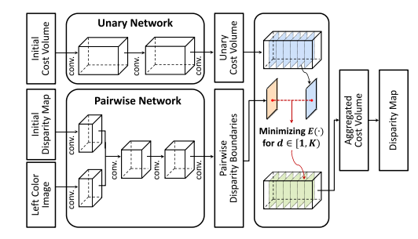

## Convolutional Cost Aggregation For Robust Stereo Matching
+ 基于CNN，提出了一种匹配成本聚合的新方法，学习CNN中的卷积核的架构，以全卷积的方式实现成本聚合：传统的成本聚合的方法使用人工构建的box-filter等，仍存在缺陷，因为窗口大小等一系列参数变化比较大，无优化的公式

+ Cost Volume的计算公式：
  $$ C(p,d)=S(I(p),I'(p-[d,0]^T)) $$
  $$ C'(p,d)=\sum _{q\in N_p}w_I(p,q)C(q,d) $$
+ 网络分为两部分，元网络Unary Network和配对网络Pairwise Network
  + Unary Network：
    + 最大优点：优化时使用了大量带有GroundTruth的视差图，使得聚合方法更为可靠
    + 卷积核大小5 x 5，个数256，256，K
    + 使用ReLU激活函数，将视差计算看作一个K-classification，使用Softmax进行计算
  + Pairwise Network：
    + 用于计算视差图的边界区域
    + 输入为左图和初始视差图，网络包括disparity feature extraction, color feature extraction, fusion
  + 在通过两个网络计算得到融合后的Cost Volume C'和视差边界图B后，使用Global Energy Minimization进行结合
+ 实验结果：
  + 初始化网络权重：均值0，方差0.001
  + 输入图像减去均值除以方差
  + 学习率0.001
  + 在MiddleBury上测试