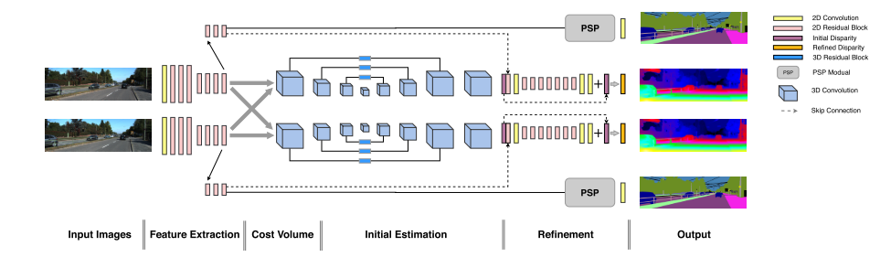

## DispSegNet: Leveraging Semantics for End-to-End Learning of Disparity Estimation from Stereo Imagery
+ CNN methods still suffer from errors in regions of low-texture, occlusions and reflections
+ 语义分割+视差估计，使用语义分割阶段的信息进行初始视差的设置，使用无监督学习的方法
+ 双目视觉传统方法：
  + window-based correlation
  + smoothing, occlusion, global-optimal matching
+ End to end 方法需要大量的带有ground truth视差标记的双目图 -> 难以获取，使用finetune的方法
+ 通过上下文语义方法来辅助视差的计算
+ 主要工作：
  + 同时输出视差图和语义分割图，二者都可用于获取图像中的语义信息
  + 设置了一种新的网络结构、一个新的平滑loss函数
  + KITTI数据集上使用无监督学习的state of art

+ Pipeline：
  + Input Image
  + Feature Extraction：
    + ResNet50
  + Cost Volume
  + Initial Estimation：
    + 8 layers Encoder-Decoder
  + Refinement
  + Output
  
  Segstereo: Exploiting semantic information for disparity estimation
  Learning for disparity estimation through feature constanc
  yramid scene parsing network