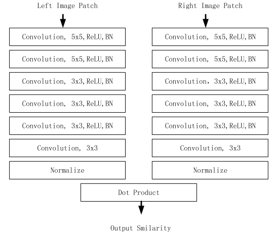

## Efficient Deep Learning for Stereo Matching With Larger Image Patches
+ 改进了CVPR2016的那篇*Efficient Deep Learning for Stereo Matching With Larger Image Patches*
+ 使用大的Patch作为输入数据，从而处理纹理区域
+ 视差图 -> 深度图：$Z=\frac{fB}{d}$
+ **是不是进行视差计算时要求图像仅在水平/垂直方向有距离差异，不能在两个方向上均有差异**
+ 常见的干扰：闭塞，物体边界，低纹理或者是重复的纹理
+ 针对大patch图片的卷积网络改进：
  + 加入更多的卷积层
  + 提升feature map的数目
  + 增加卷积核的大小
+ 网络设计：
  + 输入参数：image patch pair
  + 输出：相似度得分，由cosine similarity measure计算得到
  + 损失函数：hine loss $L=max(0,m+s_--s_+)$
 
+ post-processing：
  + semiglobal-matching
  + interpolation
  + subpixel-inhancement
  + median filter
  + bilateral filter
+ 实验结果：KITTI2015
  + 训练集：160 -> 17 million
  + 验证集：40
  + 测试集：200
+ Baseline：
  + MC-CNN
  + SAD
  + Census