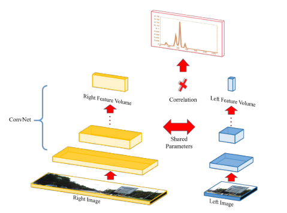
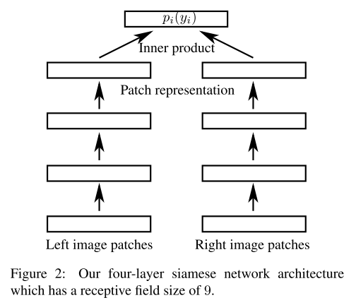

## Efficient Deep Learning for Stereo Matching(CVPR2016)
+ 介绍了一种在GPU上能以秒为处理时间的算法（传统的CNN算法耗时较长）
+ 将问题转化为一个Multi-Class的分类问题，每一个视差作为一个类别
  + 当前做法：当成一个二分类问题，对于左图的一个Patch，每次判断来自右图的一个Patch是否与之匹配——耗时很长

+ Related Work
  + 早期：校正最初计算的匹配成本，使得能量最小化
  + Slanted plane models
  + Holistic models：结合高维和低维任务
  + CNN：计算双目图的匹配代价
+ 本文工作
  + 使用一个Smooth Target Distribution计算在各个视差上的概率分布
  + 在计算双目图的CNN后使用一个简单的dot-product层来连接两支——计算速度更快

+ 实验过程：
  + 假设图像已经被校准过，即极线与水平图像轴对齐
  + $y_i\in Y_i$，表示第i个像素的视差值
  + 匹配算法建立了一个3-D的代价Volume，对左图的每个像素计算可能的视差值概率，本文使用CNN来进行匹配
  + 训练：
    + 从左图随机提取图像patch，大小为网络的感受野（9x9），$(x_i,y_i)$为从左图提取的patch的中心点，$d_{x_i,y_i}$为该patch的真实视差值 
    + => 左图经过卷积得到1x64的特征图，右图经过卷积得到$|Y_i|$x64的特征图，二者进行内积从而计算对于每一个视差片的概率值。
    + 选用的损失函数为cross_entropy，表达式为
$$\min _{\mathbf{w}} \sum_{i, y_{i}} p_{\mathrm{gt}}\left(y_{i}\right) \log p_{i}\left(y_{i}, \mathbf{w}\right)$$
    + 其中$p_{gt}$是根据3-pixel error matrix平滑过后的ground truth，有

$$p_{\mathrm{gt}}\left(y_{i}\right)=\left\{\begin{array}{ll}{\lambda_{1}} & {\text { if } y_{i}=y_{i}^{\mathrm{d} 1}} \\ {\lambda_{2}} & {\text { if }\left|y_{i}-y_{i}^{G T}\right|=1} \\ {\lambda_{3}} & {\text { if }\left|y_{i}-y_{i}^{G T}\right|=2} \\ {0} & {\text { otherwise }}\end{array}\right.$$
  + 选用的optimizer为AdaGrad
    + 测试：对每个像素计算64维的特征表示
+ 在各个数据集上的效果
  + 预处理：均值为0，标准差为1
  + 网络参数初始化：平均分布
  + 优化器：AdaGrad，学习率$1e^{-2}$，先增加后减小
  + batchsize：128
  + epoches：40K
+ 核心算法：使用一个内积层来代替原有的concatenate层和后续处理层，极大提高运行速度