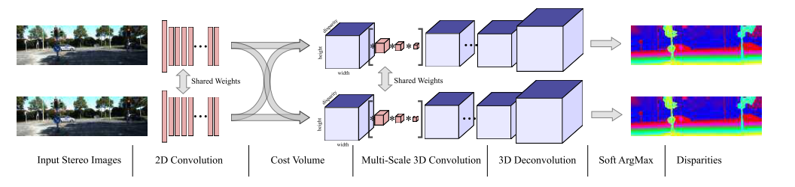

### End-to-End Learning of Geometry and Context for Deep Stereo Regression
+ 提出了一个end-to-end的深度学习方法来计算视差，图像来自于单个整流图像对
+ 使用3D-CNN计算了一个cost volume：height x width x disparity
+ our model has the capacity to learn semantic reasoning and contextual information
+ no post-processing or regularization
+ we form our model by developing differentiable layers representing each major component in traditional stereo pipelines

+ We train our model with supervised learning using ground truth depth data