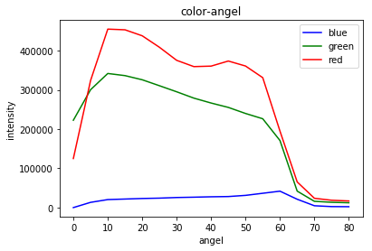
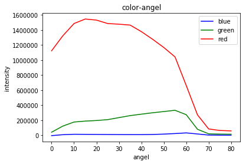
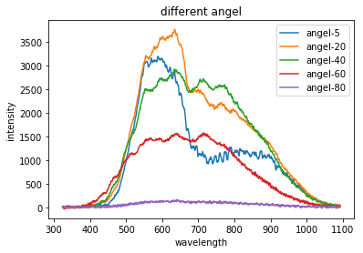

## 变色龙粉角谱分析
变色龙粉是一种特殊的涂料，将其涂布在玻片表面。当有不同角度的入射光打在玻片表面的时候，反射光线会呈现不同的波长。

在显微镜下观察时，变色龙粉可以看作一系列散乱的反光片，光线在其中传播，在不同角度时会反射出不同的波长。

我们测量了两种不同的变色龙粉在0°~80°的反射波长能量分布，希望能从能量分布的角度解释宏观上肉眼看玻片时出现的不同色彩的现象。

### 实验结果
我们将整个波段粗略划分成了三个区域，在每个波长区间内进行求和，作为该色光的总强度。
```python
def cal_rgb(arr):
    """
        角度扫射从0°到80°，间隔5°
        波长 => 颜色：
            435.8nm => Blue
            546.1nm => Green
            700.0nm => Red
        
        定义区分间隔：
            B: 380.7nm => 490.9nm
            G: 490.9nm => 598.1nm
            R: 598.1nm => 700.0nm
        
    """
    intensity_b = []
    intensity_g = []
    intensity_r = []
    
    for angel in range(17):
        intensity_b.append(np.sum(arr[71:212, angel]))
        intensity_g.append(np.sum(arr[213:352, angel]))
        intensity_r.append(np.sum(arr[353:487, angel]))
    
    intensity_b = np.array(intensity_b)
    intensity_g = np.array(intensity_g)
    intensity_r = np.array(intensity_r)
    
    return intensity_b, intensity_g, intensity_r
```
实验结果如下：




这里就有一个问题，按照角谱-波长图可以看出，随着反射角的增大，500-700nm波段的能量与700-900nm波段的能量的比值在逐步减小，临界点大概在700nm左右。然而人肉眼可分辨的光大约在400-650nm，并没有涉及到这个显著的比例变化问题。

另一方面，在划分过波长区域后的统计图中，可以明显看到红光一直处于主导地位，而蓝光和绿光却基本保持不变，并不能解释肉眼看上去的显著变色现象。

